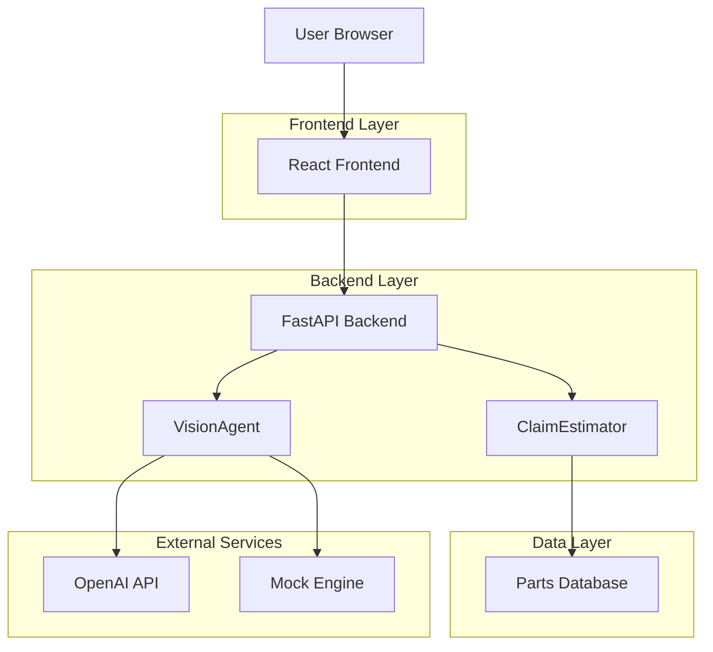

# System Architecture - Full Stack Application

## Overview

The Motor Claim Estimator has been transitioned from a Streamlit prototype to a full-stack application with FastAPI backend and React frontend, maintaining the core business logic while providing a modern, scalable architecture.

## High-Level Architecture



## Component Details

### 1. Frontend (React + Tailwind CSS)
- **Framework**: React 18 with Vite build tool
- **Styling**: Tailwind CSS for responsive design
- **Responsibilities**:
  - Handle user image uploads with drag-and-drop interface
  - Display configuration options (API keys, Model selection)
  - Visualize damage assessment with interactive components
  - Present cost estimation tables and summaries
  - Provide real-time feedback during processing

### 2. Backend (FastAPI)
- **Framework**: FastAPI for high-performance async API
- **Responsibilities**:
  - Expose RESTful endpoints for claim analysis
  - Handle file uploads and validation
  - Orchestrate business logic execution
  - Provide error handling and validation
  - Serve static files and API documentation

### 3. Core Logic (`app/core.py` - Retained)
- **Class**: `ClaimEstimator`
- **Responsibilities**:
  - Orchestrate the workflow (Image -> Analysis -> Cost)
  - Load and query the Parts Database (`data/parts_db.json`)
  - Calculate labor costs based on severity and hourly rates
  - Apply business rules (e.g., Pre-approval threshold)

### 4. Vision Model (`app/vision_model.py` - Retained)
- **Class**: `VisionAgent`
- **Responsibilities**:
  - Abstract the AI provider (OpenAI, Gemini, Mock)
  - Prepare image data (Base64 encoding)
  - Construct prompts for the Vision LLM
  - Parse JSON responses from the LLM

### 5. Data Layer (`data/`)
- **Parts Database**: JSON file mapping part names to base costs and labor hours
- **Future Extension**: Can be migrated to PostgreSQL or external API

## API Endpoints

### Claim Analysis Endpoint
```
POST /api/analyze-claim
Content-Type: multipart/form-data

Parameters:
- image: File (required) - Car damage image file
- provider: String (optional) - AI provider ("openai", "gemini", "mock")
- api_key: String (optional) - API key for AI service
- labor_rate: Float (optional) - Hourly labor rate (default: 75.0)

Response:
{
  "status": "success",
  "data": {
    "damage_assessment": {...},
    "cost_estimate": {...},
    "status": "Pre-Approved" | "Needs Manual Review"
  }
}
```

### Health Check Endpoint
```
GET /api/health
Response: {"status": "healthy", "timestamp": "2024-01-01T00:00:00Z"}
```

## Data Flow

1. **Upload**: User uploads an image via React frontend
2. **Validation**: FastAPI validates file type and size
3. **Analysis**: Backend calls `VisionAgent` to analyze image with selected AI provider
4. **Parsing**: The LLM returns a JSON structure listing damaged parts
5. **Estimation**: `ClaimEstimator` calculates costs using parts database
6. **Response**: Results are formatted and returned to frontend
7. **Display**: React components visualize the damage assessment and cost breakdown

## Technology Stack

### Frontend
- React 18.2.0
- Tailwind CSS 3.3.0
- Vite 4.4.0
- Axios for API calls
- React Dropzone for file uploads

### Backend
- FastAPI 0.104.0
- Python 3.9+
- Uvicorn ASGI server
- Pydantic for validation
- python-multipart for file handling

### Core Dependencies (Retained)
- OpenAI Python client
- OpenCV for image preprocessing
- Pillow for image handling

## Deployment Architecture

### Development
- Frontend: Vite dev server with hot reload
- Backend: Uvicorn with auto-reload
- Both services run independently with CORS enabled

### Production
- Frontend: Static build served by CDN or backend
- Backend: Containerized FastAPI application
- Load balancer for scalability
- Environment-based configuration management

## Security Considerations

1. **API Key Management**: Client-side API keys are optional; backend can use environment variables
2. **File Validation**: Strict file type and size validation on backend
3. **CORS Configuration**: Proper CORS setup for cross-origin requests
4. **Rate Limiting**: Implement rate limiting for API endpoints
5. **Error Handling**: Sanitized error messages to prevent information leakage

## Migration Benefits

1. **Scalability**: FastAPI provides better performance than Streamlit for production workloads
2. **Separation of Concerns**: Clear frontend/backend separation enables independent development
3. **Modern UX**: React enables richer user interactions and responsive design
4. **API-First**: RESTful API enables future mobile app or third-party integrations
5. **Maintainability**: Component-based architecture improves code organization