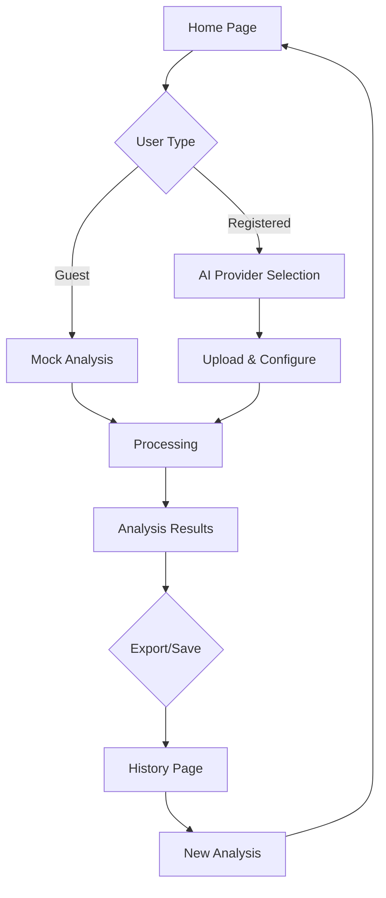

# Product Requirements Document - Motor Insurance Claim Estimator

## 1. Product Overview

The Motor Insurance Claim Estimator is a full-stack web application that uses AI-powered image analysis to assess vehicle damage and generate instant cost estimates for insurance claims. Insurance adjusters, repair shops, and vehicle owners can quickly upload photos of damaged vehicles and receive detailed repair cost breakdowns with pre-approval status.

This product solves the problem of time-consuming manual damage assessment by providing instant, AI-driven estimates that streamline the insurance claim process and reduce processing time from days to minutes.

## 2. Core Features

### 2.1 User Roles

| Role | Registration Method | Core Permissions |
|------|---------------------|------------------|
| Guest User | No registration required | Can analyze claims with mock AI provider, limited to 5 analyses per session |
| Registered User | Email registration | Can use all AI providers, save analysis history, export reports |
| Premium User | Subscription upgrade | Unlimited analyses, priority processing, advanced reporting features |

### 2.2 Feature Module

Our motor insurance claim estimator consists of the following main pages:

1. **Home page**: Hero section with upload interface, AI provider selection, real-time processing status.
2. **Analysis page**: Damage visualization, cost breakdown table, repair recommendations, approval status.
3. **History page**: Past analyses with search and filter options, report export functionality.

### 2.3 Page Details

| Page Name | Module Name | Feature description |
|-----------|-------------|---------------------|
| Home page | Upload Interface | Drag-and-drop or click to upload car damage photos (JPG, PNG, max 10MB). Show upload progress and preview thumbnail. |
| Home page | AI Provider Selection | Dropdown to select AI analysis provider (Mock Demo, GPT-4o, Gemini 1.5 Pro). Optional API key input for premium providers. |
| Home page | Configuration Panel | Labor rate input field (default $75/hr), currency selection, damage sensitivity slider. |
| Home page | Process Button | Initiate analysis with loading animation and real-time status updates. |
| Analysis page | Damage Visualization | Display uploaded image with highlighted damage areas using colored overlays. Show damage confidence scores. |
| Analysis page | Cost Breakdown Table | Sortable table showing damaged parts, severity levels, part costs, labor hours, and total costs. |
| Analysis page | Summary Card | Display total estimate amount, tax calculation, pre-approval status with color-coded indicators. |
| Analysis page | Action Buttons | Options to download PDF report, share results, or start new analysis. |
| History page | Search Bar | Filter past analyses by date range, vehicle type, or damage severity. |
| History page | Analysis Cards | Grid view of previous analyses with thumbnails, total costs, and quick actions. |
| History page | Export Options | Download detailed reports in PDF or CSV format for insurance documentation. |

## 3. Core Process

### Guest User Flow
1. User lands on homepage and uploads vehicle damage photo
2. System automatically selects mock AI provider for demonstration
3. User clicks "Analyze Damage" to start processing
4. System displays loading animation while AI analyzes the image
5. Results page shows damage assessment and cost estimate
6. User can start new analysis or register for full features

### Registered User Flow
1. User logs in and accesses full homepage features
2. Uploads damage photo and selects preferred AI provider
3. Configures analysis parameters (labor rate, sensitivity)
4. Initiates analysis with real-time progress updates
5. Reviews detailed results with export options
6. Analysis is automatically saved to history
7. User can access complete analysis history and reports

## 4. User Interface Design

### 4.1 Design Style

- **Primary Colors**: 
  - Blue #2563eb (primary actions, headers)
  - Green #16a34a (success, approved status)
  - Red #dc2626 (damage indicators, errors)
  - Gray #6b7280 (secondary text, borders)

- **Button Style**: Rounded corners (8px radius), subtle shadows, hover animations
- **Typography**: Inter font family, 16px base size, clear hierarchy with font weights
- **Layout**: Card-based design with consistent spacing (8px grid system)
- **Icons**: Heroicons for consistency, emoji for friendly tone

### 4.2 Page Design Overview

| Page Name | Module Name | UI Elements |
|-----------|-------------|-------------|
| Home page | Upload Interface | Large dashed dropzone with car icon, file type/size hints, upload progress bar with percentage |
| Home page | AI Provider Card | Clean selection cards with provider logos, radio buttons for selection, API key input with show/hide toggle |
| Analysis page | Results Container | White card with subtle shadow, damage image with overlay legend, cost table with striped rows |
| Analysis page | Status Indicator | Large colored badge showing "Pre-Approved" or "Manual Review Required" with appropriate icons |
| History page | Analysis Grid | Responsive card grid, thumbnail images, cost badges, hover effects with action buttons |

### 4.3 Responsiveness

- **Desktop-first** approach with mobile optimization
- **Breakpoints**: 640px (mobile), 768px (tablet), 1024px (desktop)
- **Touch optimization**: Larger tap targets on mobile, swipe gestures for image gallery
- **Progressive enhancement**: Core functionality works without JavaScript, enhanced experience with JS

### 4.4 3D Scene Guidance

Not applicable for this 2D web application. The focus is on clear data visualization and intuitive user interface design rather than 3D rendering.